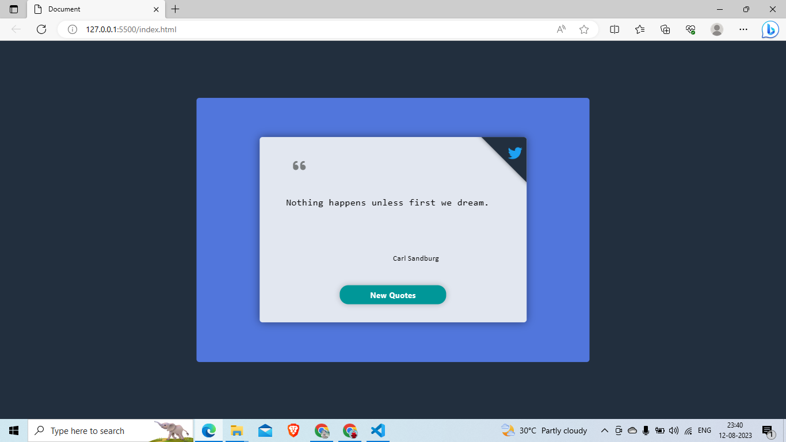

# Quotes Generator

The Quotes Generator is a simple web application that displays random inspirational quotes. It allows users to click a button to fetch a new quote and also provides an option to share the quote on Twitter. The project is built using HTML, CSS, and JavaScript, and it utilizes the Type.fit API to fetch the quotes.

## Features

- Display a random quote with the author's name.
- Fetch a new quote with the click of a button.
- Share the displayed quote on Twitter.
- Responsive design using AOS (Animate On Scroll) for smooth animations.

## Live Demo

You can check out the live demo of the Quotes Generator [here](https://your-demo-url.com).

## Installation and Usage

1. Clone this repository to your local machine using:

2. Open the project folder in your favorite code editor (e.g., Visual Studio Code).

3. Open `index.html` in a web browser or use a local server to run the project.

4. Click the "New Quotes" button to fetch and display a new quote.

5. Click the Twitter icon to share the displayed quote on Twitter.

## Dependencies

- [Font Awesome](https://fontawesome.com) - For icons.
- [AOS (Animate On Scroll)](https://github.com/michalsnik/aos) - For animations.

## Credits

Quotes provided by [Type.fit API](https://type.fit/api/quotes).

## License

This project is licensed under the MIT License. Feel free to use and modify the code as per your needs.

## Acknowledgements

Special thanks to [Aman Agrahari] for inspiration and guidance throughout the development of this project.

---

Feel free to customize this README file according to your project's details and structure. Include any additional information or sections that you think are relevant. Good luck with your mini project!
